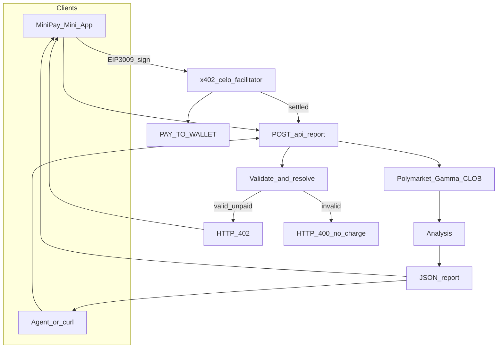

# PolyPulse

**An AI agent for prediction-market intelligence — paid on Celo via x402, used inside MiniPay.**

PolyPulse is a production pay-per-request agent that sells structured Polymarket BTC Up/Down intelligence through **Celo-native x402 micropayments**.

Instead of another keyed API or subscription dashboard, PolyPulse is packaged as a **MiniPay-first economic agent**: discover it, open it in MiniPay, validate a market, pay once in USDC, execute exactly once, and receive a schema-stable report.

Users (or other agents) submit a Polymarket event URL or market slug. After validation, PolyPulse settles a flat USDC fee on Celo and returns recent market activity plus a short AI analysis.

Every request follows the same deterministic lifecycle:

**Validate → Challenge (HTTP 402) → Pay (EIP-3009) → Settle once → Deliver**

No API keys.  
No subscriptions.  
No prepaid ledger.  
No charge on invalid markets.  
No duplicate delivery for the same settlement.

Live: [https://polypulse.up.railway.app](https://polypulse.up.railway.app)

---

## Pitch for judges

PolyPulse targets **Track 2 — Most x402 Payments** in the Celo Agentic Payments & DeFAI Hackathon.

| | |
|---|---|
| **Track** | Track 2 — Most x402 Payments |
| **Settlement** | Celo x402 facilitator (`network: celo`) |
| **Human UX** | MiniPay Mini App (auto-connect, no Connect button inside MiniPay) |
| **Price** | **$0.05 USDC** per report (mainnet) |
| **Model** | Pay-per-call only — every successful report is one counted settlement to `PAY_TO_WALLET` |
| **Stack** | Next.js (UI + API) · Neon/Prisma receipts · thirdweb settle · Polymarket Gamma/CLOB · Anthropic analysis |

Winning Track 2 means **real micropayment count**, not demo volume. PolyPulse is built so every completed order is a legitimate, independently settled on-chain payment.

---

## The background

Prediction markets such as Polymarket generate continuous, high-signal market data:

- recent trade flow  
- momentum and side pressure  
- liquidity and activity bursts  
- probability / price movement  

Professionals already use this intelligence. Accessing it still usually means API keys, subscriptions, custom glue code, and infrastructure.

Meanwhile AI agents are getting better at research — but the **commerce layer** for agents to sell that research as paid services (especially to mobile users on Celo) is still thin.

Most “AI tools” are SaaS APIs. They do not naturally sit inside a wallet like MiniPay, settle with HTTP 402, or produce a machine-readable receipt other agents can reuse.

PolyPulse explores that shape on **Celo**.

---

## The problem

Current AI services hit structural limits:

- Models cannot natively receive payments  
- Trust sits on centralized billing platforms  
- APIs need auth + subscription systems for tiny requests  
- Consumers often cannot verify that execution happened once  
- Reputation is trapped inside a product UI  
- Agents cannot easily hire other agents with micropayments  

For a **$0.05** market pulse, operational overhead of keys and monthly plans is larger than the request itself. That blocks an open agent economy.

---

## How PolyPulse + Celo x402 solve it

PolyPulse is a reference loop for **agentic micropayments on Celo**, optimized for MiniPay humans and agent callers on the same endpoint.

### Identity & distribution

- Public HTTPS Mini App on Railway  
- Opened inside **MiniPay** (`window.ethereum.isMiniPay`)  
- Optional later Telegram front door only deeplinks into MiniPay — signing never happens in Telegram  

### Negotiation (validate before pay)

Before any charge:

1. Parse Polymarket URL or slug  
2. Resolve market → `condition_id`  
3. Reject invalid / unsupported requests with **HTTP 400** (never charged)  
4. BTC Up/Down focus for v1 (honest scope, reliable demo)  

Only executable requests reach payment.

### Payment

Each report is an independent **x402** settlement on Celo mainnet:

- Unpaid valid request → **HTTP 402** + payment requirements  
- MiniPay signs **EIP-3009** USDC authorization  
- Facilitator verifies and settles on-chain  
- Seller `PAY_TO_WALLET` receives the fee (Track 2 counting surface)  

Guarantees:

- **Pay only after validation**  
- **Execute exactly once** per settlement (Neon `ReportReceipt` by `paymentKey`)  
- **No subscription / no deposit balance**  

### Delivery

After settlement, one deterministic workflow returns JSON:

- resolved market metadata  
- recent trades from Polymarket CLOB  
- short AI `analysis` (with safe fallback if the LLM is unavailable)  

### Reputation / verifiability

- Settlements are on-chain via the Celo x402 facilitator  
- Receipts are persisted in Postgres (status, input, report payload)  
- Judges can verify the live app + payTo wallet on the hackathon leaderboard once registered  

---

## Deliverable schema

**Input**

| Field | Type | Notes |
|-------|------|-------|
| `url` | string | Polymarket event URL or market slug |
| `limit` | number | optional; max trades (default 20, max 100) |

**Output**

| Field | Type | Notes |
|-------|------|-------|
| `input` | string | echo of original input |
| `slug` | string | resolved market slug |
| `condition_id` | string | Polymarket condition ID |
| `limit` | number | requested limit |
| `count` | number | trades returned |
| `trades` | array | recent trade records |
| `positions` | array | reserved for v2 wallet/position intel |
| `analysis` | string | short generated summary |
| `timestamp` | string | ISO 8601 delivery time |

Deterministic and machine-readable so other agents can consume PolyPulse without custom parsers.

`POST /api/report` — same contract for MiniPay UI and agent clients.

---

## How it’s built

### Product surface

- **MiniPay Mini App** — paste URL → approve USDC → read report  
- **Order Details** UX — Url / Limit / Price ($0.05)  
- Auto-connect in MiniPay; Connect only outside MiniPay  

### Payment rail

- Server: thirdweb `settlePayment` + facilitator, `network: celo`  
- Client: MiniPay-native EIP-3009 signer (local `viem` + `window.ethereum`) on HTTP 402  
- Headers: `PAYMENT-SIGNATURE` / `X-PAYMENT`  
- Canonical resource URL from `APP_URL` / `NEXT_PUBLIC_APP_URL`  

### Data & execution

- Polymarket **Gamma** (resolve) + **CLOB** (trades)  
- Anthropic (optional) for `analysis`  
- Prisma / Neon for exactly-once receipts  

### Hosting

- Railway — UI + API in one Next.js process  
- Live domain: `https://polypulse.up.railway.app`  



---

## Why it matters

PolyPulse is not “another crypto analytics page.”

It shows that an AI agent can be an **economic participant on Celo**:

- Services instead of opaque APIs  
- Revenue per task instead of subscriptions  
- Wallet-native UX for Celo’s MiniPay distribution  
- Facilitator-settled micropayments that count for Track 2  
- Composable JSON other agents can hire automatically  

The agent economy needs payment infrastructure — not only better models. PolyPulse is a concrete Celo implementation of that loop.

---

## What’s next

### v1 (now)

- BTC Up/Down intelligence  
- MiniPay pay-per-report  
- Exactly-once delivery  
- Live Railway deployment  

### v2 — richer market intelligence

- Multi-market categories (ETH, politics, sports, macro)  
- Deeper trade / liquidity signals  
- Confidence scoring on analysis  

### v3 — research agent

Longer structured briefs: sentiment, probability shifts, comparable events — still settled per request via x402.

### v4 — distribution

Telegram / OpenClaw as a **front door only** → MiniPay deeplink (`/pay?requestId=`) → pay in MiniPay → optional report handoff.

### Out of scope for this submission

- Prepaid credits / custodial balances  
- In-Telegram wallet signing  
- Track 1 volume farming  
- Full multi-agent trading orchestration  

---

## Vision

PolyPulse is not trying to be the best BTC chart app.

Its goal is to demonstrate an open **AI commerce** pattern on Celo: agents and humans discover a service, validate a job, settle trustlessly with x402, execute once, and accumulate verifiable settlement history.

That is the infrastructure bet behind Track 2 — and the product bet behind MiniPay.

---

## Quick start

```bash
npm install
cp .env.example .env   # fill DATABASE_URL, thirdweb, wallets, APP_URL
npm run db:push
npm run dev            # http://localhost:3000
```

**MiniPay test:** open the Railway HTTPS URL in MiniPay → paste a BTC Polymarket URL → approve **$0.05 USDC** on Celo → read the report.

Required env: `DATABASE_URL`, `CLIENT_SECRET`, `SERVER_WALLET`, `PAY_TO_WALLET`, `REPORT_PRICE`, `NEXT_PUBLIC_APP_URL`, `NEXT_PUBLIC_CLIENT_ID` (see `.env.example`).

---

## Hackathon submission notes

- **Primary track:** Track 2 — Most x402 Payments  
- Register `PAY_TO_WALLET` on Celo Builders / submission flow  
- Settlements use Celo facilitator — counted when payTo is on file ([Dune leaderboard](https://dune.com/celo/agentic-payments-defai-hackathon))  
- ERC-8004 agent registration for final submit  
- Tweet template: tag **@CeloDevs** + **@Celo** with demo + registry link  

### Resources

- [x402.celo.org](https://x402.celo.org)  
- [MiniPay quickstart](https://docs.celo.org/build-on-celo/build-on-minipay/quickstart)  
- [MiniPay deeplinks](https://docs.minipay.xyz/technical-references/deeplinks.html)  
- [MiniPay add cash](https://minipay.opera.com/add_cash)  
- [Celopedia](https://celopedia.xyz)  
- Celo Builders: `npx skills add https://celobuilders.xyz`
