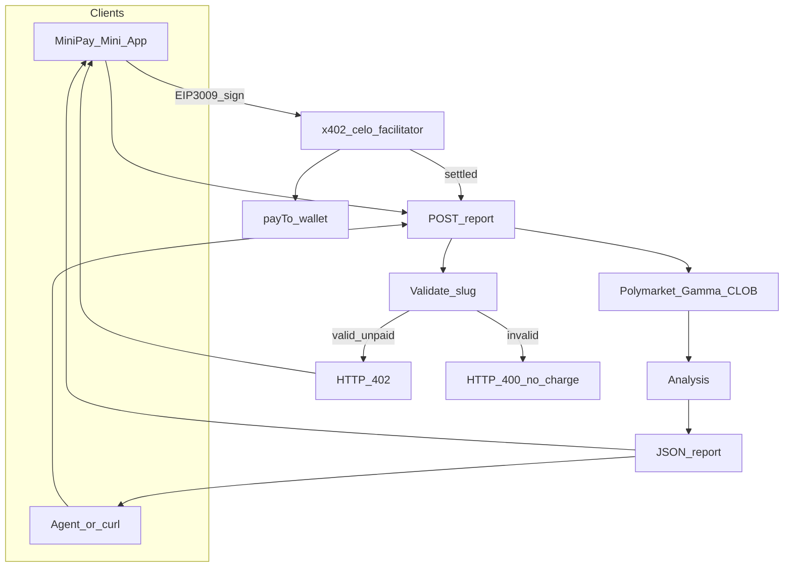

# PolyPulse

**Celo Prediction-Market Intelligence Agent**

A pay-per-request AI agent that sells structured Polymarket market and wallet intelligence — **MiniPay-first**: open in MiniPay, pay USDC via x402, get the report. Built for Celo’s 16M+ MiniPay users.

> Working build plan for the **Celo Agentic Payments & DeFAI Hackathon** (July 7 – August 3, 2026). **$5K prize pool** (distributed in CELO). Primary target: **Track 2 — Most x402 Payments**.

---

## One-line pitch

A pay-per-call agent that returns a structured Polymarket intelligence report for a flat USDC fee, settled on Celo via x402. **Primary UX is MiniPay** (paste URL → pay → report). Agents hit the same API; Telegram is an optional later handoff into MiniPay, not the main product.

---

## Hackathon Context

| | |
|---|---|
| **Event** | Celo Agentic Payments & DeFAI Hackathon |
| **Prize pool** | $5,000 (distributed in CELO) |
| **Window** | July 7 – August 3, 2026, 9:00 AM GMT |
| **Winners announced** | August 6, 2026 |
| **Primary track** | Track 2 — Most x402 Payments ($1,000, in CELO) |
| **Track 1 status** | Not a realistic win with this build — see [Track Feasibility](#2-track-feasibility) |
| **Payment model** | MiniPay-first pay-per-report via x402 (no prepaid ledger) |
| **Primary UX** | MiniPay Mini App |
| **Document date** | July 23, 2026 |

Winning projects move real money onchain on Celo. Teams are expected to go beyond prototypes; winning agents generate real transactions and demonstrate genuine utility onchain. Celo's tooling enables agents across global payments and stablecoin-native transactions, with **16M+ MiniPay users** as a distribution surface.

### Timeline

| Date | Milestone |
|------|-----------|
| Jul 7, 2026 | Hackathon kick-off |
| Aug 3, 2026 — 9:00 AM GMT | Submission deadline |
| Aug 6, 2026 | Winners announced |

### Prize tracks

| Track | Prize | Win condition | Fit for this build |
|-------|-------|---------------|--------------------|
| 1. Most Revenue Generated | $3,000 | Highest volume of **tagged** on-chain transactions | Poor — see §2.4 |
| 2. Most x402 Payments | $1,000 | Highest count of settled x402 payments | **Strong — primary target** |
| 3. Askbots | $500 | Highest-rated judge agent on askbots.ai | Out of scope |
| 4. Aigora Feedback | $500 | Top 10 feedback submissions | Not a build track |

#### Track 1 detail — Most Revenue Generated ($3,000 in CELO)

- 1st: $2000 · 2nd: $1000
- Win condition: most on-chain volume on Celo during the hackathon (Jul 7–Aug 3)
- Tracking: integrate **Attribution Tags** (ERC-8021) so agent transactions are tagged; submit wallet / tagged transactions link
- Ideas: DeFi product, FX trading agent, etc.

#### Track 2 detail — Most x402 Payments ($1,000 in CELO)

- 1st: $700 · 2nd: $300
- Win condition: most settled x402 payments on Celo — raw count of successful pay-per-request transactions
- Tracking:
  - Register on celobuilders
  - Route payments through Celo x402 facilitator: [x402.celo.org](https://x402.celo.org)
  - Add agent/payTo wallet to submission — every settlement to/from that wallet is counted automatically
  - No tagging needed for settlements (facilitator sends the settlement tx, so it can't carry your tag)
- Attribution is **retroactive** from July 1; wallet must be on file to appear on the [live Dune leaderboard](https://dune.com/celo/agentic-payments-defai-hackathon)

#### Track 3 — Askbots ($500 in CELO)

- Highest-rated agents on askbots.ai: $450 across 5 positions (150 / 100 / 80 / 70 / 50)
- Register judge agent on AskBot; submit via Celo Builder Skill

#### Track 4 — Best Feedback for Aigora ($500 in CELO)

- Top 10 most valuable feedback submissions: $50 CELO each
- Register on aigora.org, submit feedback, submit project via Celo Builder Skill

### Authenticity requirement

Judges conduct manual review specifically to catch sybil attempts and inauthentic volume. This build avoids being a verbatim clone of reference products (Polymarket wallet-report services and “BtcForecast” on CROO/CAP + Base). Differentiation:

- Multi-category market coverage
- Native settlement on Celo's own x402 facilitator
- **MiniPay-native** human product (the main vibe / demo surface)
- Only genuine usage counted — not self-looped calls to inflate a counter

---

## 2. Track Feasibility

### 2.1 Track 2 (x402 Payments) — strong fit

Track 2 rewards a raw count of successful x402 settlements to a registered payTo wallet. A narrow, cheap, reliable service can accumulate many legitimate settlements without large trading capital. Settlement is sent by the facilitator itself, so no attribution tag is required on the settlement transaction — only the payTo wallet needs to be on file.

### 2.2 Track 1 (Most Revenue Generated) — weak fit

The Track 1 brief requires **Attribution Tags** and wins on **on-chain volume**, not raw tx count. FAQ: “the leaderboard only counts transactions that carry your tag.”

The core action of this agent — receiving an x402 micropayment — is settled by the **facilitator**, not by the agent's wallet initiating a tagged transaction. Track 2 rules confirm: “no tagging needed for settlements (the facilitator sends the settlement transaction itself, so it can't carry your tag).”

That design choice is ideal for Track 2 and invisible to Track 1's tag-based volume tracking. Track 1 suggested ideas (DeFi / FX agents) are agents whose core action is an **agent-initiated** on-chain transaction that can carry a tag — a different pattern than facilitator-settled micropayments.

### 2.3 What would be needed to compete for Track 1

- **Option A — minimal add-on:** periodically sweep collected USDC revenue into CELO via a tagged on-chain swap (real tagged volume, but small vs dedicated Track 1 projects).
- **Option B — separate project:** dedicated DeFi/FX agent whose main function is a taggable on-chain transaction — different build, separate scoping.

### 2.4 Recommendation

Stay focused on **Track 2**. Register for the attribution tag anyway (one setup step) and apply it to any transaction that can carry it, but do not add build scope chasing Track 1 volume with this agent. If Track 1's larger prize is more attractive, treat it as a separate project decision.

---

## 3. Product Concept

### Real use cases

- **Copy-trade due diligence:** verify a “smart wallet” before mirroring — PnL, win rate, and trade history in one shot.
- **Tip verification:** structured check of claims like “this wallet called the last 5 elections correctly.”
- **Agent-to-agent input:** other trading/research agents can use wallet or market intelligence as a weighting signal (e.g. which side historically-accurate wallets are on).

### Human interface — MiniPay (primary)

This is the **main product vibe**: a mobile Mini App inside [MiniPay](https://docs.celo.org/build-on-celo/build-on-minipay/quickstart).

1. User opens PolyPulse in MiniPay (Discover / browse link)
2. Pastes a Polymarket URL or market slug
3. Wallet auto-connects (`window.ethereum.isMiniPay` — no Connect button inside MiniPay)
4. Pays a flat USDC fee via **x402** (EIP-3009 signed in MiniPay)
5. Sees the structured report in the same MiniPay UI

**Payment model (locked):** pay-per-report only. Funds live in MiniPay (cash-in via `https://minipay.opera.com/add_cash` or elsewhere). No PolyPulse prepaid ledger — every report is one x402 settlement to `payTo` (Track 2).

Agents/scripts call the same `POST /report` backend without the UI.

### Optional: Telegram → MiniPay (nice-to-have)

Not the main experience. If built later, Telegram only **sends the user into MiniPay** via deeplink to pay; it never signs payment itself. Ship MiniPay end-to-end first.

### Differentiation

- **MiniPay-first** UX aimed at Celo’s mobile wallet base
- Multi-category coverage (crypto + politics/sports/macro)
- Native Celo x402 settlement (`x402.celo.org`, `network: celo`)
- Machine-readable JSON for other agents

---

## 4. Technical Flow

### Primary path: MiniPay → x402 → report

MiniPay UI and agent/API clients share `POST /report`. Settlement always goes through Celo's x402 facilitator. Telegram is omitted from the core diagram on purpose — it is optional distribution, not the core loop.



### End-to-end request lifecycle

```
CLIENT (MiniPay Mini App or agent)
  |
  | 1. POST /report { url_or_slug, limit? }
  v
API ENDPOINT
  | 2. VALIDATE input
  |    - resolve Polymarket URL/slug -> condition_id
  |    - reject invalid requests (HTTP 400, NOT CHARGED)
  v
  | 3. IF valid but unpaid -> return HTTP 402 Payment Required
  |    (thirdweb x402 SDK: network=celo, payTo=<wallet>, price="$0.05-0.10")
  v
CLIENT signs a stablecoin payment authorization off-chain (EIP-3009)
  |  - MiniPay: wrapFetchWithPayment / useFetchWithPayment
  |  - Agent: signs with its own Celo-compatible account
  | 4. Client retries with X-PAYMENT / PAYMENT-SIGNATURE
  v
FACILITATOR (x402.celo.org / thirdweb)
  |  - verifies payload, submits on-chain, pays gas
  |  - funds move payer -> seller in the token contract
  v
  | 5. Payment confirmed -> execute EXACTLY ONCE
  v
DATA LAYER
  |  - Gamma API + CLOB API + optional LLM analysis
  v
  | 6. Return structured JSON
  |  - MiniPay UI renders it (primary demo)
  |  - Agents consume JSON as-is
```

### MiniPay UI steps

1. Detect MiniPay (`window.ethereum?.isMiniPay`) and auto-connect; hide Connect inside MiniPay
2. User funds via MiniPay cash-in if needed — **not** a PolyPulse deposit page
3. On HTTP 402: sign → retry with payment header
4. Render the report in MiniPay

### Why this satisfies Track 2

Every completed settlement to the registered `payTo` wallet counts for Track 2. MiniPay (or an agent wallet) signs; the facilitator settles. Attribution is retroactive from July 1 once the wallet is on file.

Attribution is retroactive: add the wallet at any point and every settlement since July 1 is counted. Until then the agent will not appear on the live Dune leaderboard — register the wallet early.

### Deliverable schema

**Input**

| Field | Type | Notes |
|-------|------|-------|
| `url` | string | Polymarket event URL or market slug |
| `limit` | number | optional; max trades to return (default 20) |

**Output**

| Field | Type | Notes |
|-------|------|-------|
| `input` | string | echo of original input |
| `slug` | string | resolved market slug |
| `condition_id` | string | resolved Polymarket condition ID |
| `limit` | number | |
| `count` | number | number of trades returned |
| `trades` | array | recent trade records |
| `positions` | array | (v2) wallet-level position data |
| `analysis` | string | short generated summary |
| `timestamp` | string | ISO 8601 delivery time |

---

## 5. Tech Stack

| Layer | Choice | Notes |
|-------|--------|-------|
| Runtime | Node.js + TypeScript | Matches thirdweb x402 SDK examples |
| Human client | Next.js MiniPay-compatible dApp | In-app browser; auto-connect when `isMiniPay`; `/pay?requestId=` for Telegram handoff |
| Chat front door | OpenClaw (or simple Telegram bot) | Queries only; payment via MiniPay deeplink — not in-chat signing |
| Wallet UX | MiniPay (+ Celo EOA for desktop testing) | Signs EIP-3009 for x402; **not** the seller payTo wallet |
| Payment / settlement | thirdweb/x402 SDK, `network: celo` | Wraps Celo's native facilitator (`x402.celo.org`); client uses `wrapFetchWithPayment` / `useFetchWithPayment` |
| Alternative rail | Machine Payments Protocol (MPP) | Same facilitator; optional dual-rail |
| Data source | Polymarket Gamma API + CLOB API | Market/event resolution, trades, positions |
| AI summary | Small LLM call | Generates the short `analysis` field |
| Hosting | Railway / Render / Fly.io | Public HTTPS endpoint (API + UI + bot webhook) |
| Seller wallet | Celo-compatible (Para or plain EOA) | Used as payTo / attribution wallet |
| Registration | Celo Builders skill | `npx skills add https://celobuilders.xyz` |

### Reference payment integration (thirdweb x402, Celo)

```ts
// app/api/report/route.ts
import { settlePayment, facilitator } from "thirdweb/x402";
import { createThirdwebClient } from "thirdweb";
import { celo } from "thirdweb/chains";

const client = createThirdwebClient({
  secretKey: process.env.THIRDWEB_SECRET_KEY,
});

const thirdwebFacilitator = facilitator({
  client,
  serverWalletAddress: "0xYourServerWalletAddress",
});

export async function POST(request: Request) {
  const paymentData =
    request.headers.get("PAYMENT-SIGNATURE") ||
    request.headers.get("X-PAYMENT");

  const result = await settlePayment({
    resourceUrl: "https://your-api.com/api/report",
    method: "POST",
    paymentData,
    payTo: "0xYourWalletAddress",
    network: celo,
    price: "$0.05",
    facilitator: thirdwebFacilitator,
    routeConfig: {
      description: "Polymarket market intelligence report",
      mimeType: "application/json",
    },
  });

  if (result.status === 200) {
    const report = await buildReport(await request.json());
    return Response.json(report);
  }

  return result.response; // returns 402 with payment requirements
}
```

---

## 6. Development Schedule (Jul 23 → Aug 3)

| Day | Date | Focus | Key tasks |
|-----|------|-------|-----------|
| 1 | Jul 23–24 | Setup | Register via Celo Builders skill (attribution tag); set up seller payTo wallet; scaffold API; confirm test `settlePayment()` on `network: celo` |
| 2–3 | Jul 25–26 | Core deliverable | URL/slug → condition_id resolution; fetch recent trades; structured unpaid-path response; validate before charging |
| 4 | Jul 27 | Payment integration | Full 402 flow: unpaid → 402 → paid retry → deliver; exactly-once execution |
| 5 | Jul 28 | MiniPay UI + breadth | Minimal UI: MiniPay auto-connect, pay via `wrapFetchWithPayment`, show report; AI `analysis`; second market category (non-BTC). **No deposit/credits ledger** |
| 6 | Jul 29 | Reliability + handoff prep | Invalid slugs, empty trades, timeouts; `requestId` pay page + webhook hook for Telegram delivery |
| 7–8 | Jul 30–31 | Telegram front door + distribution | OpenClaw/Telegram bot → MiniPay deeplink → report back; share in hackathon Telegram; genuine usage only |
| 9 | Aug 1 | Submission prep | Description + demo; ERC-8004 registry link; tweet copy |
| 10 | Aug 2 | Buffer | Fix issues; confirm wallet on file and settlements on Dune leaderboard |
| — | Aug 3, 9:00 AM GMT | Submit | Tweet tagging @CeloDevs + @Celo with ERC-8004 link; finalize via Celo Builders skill with payTo wallet |

---

## 7. Submission Checklist

### 7.1 Registration — do this first

- Install Celo Builders skill: `npx skills add https://celobuilders.xyz`
- Register project (name, public GitHub repo, Telegram handle) to receive ERC-8021 attribution tag (`celo_...`)
- If also tagging with a custom code, keep it and include the assigned tag: `toDataSuffix(['your_code','your_assigned_tag'])` — only the assigned tag is credited

### 7.2 Track 2 specific

- Route all payments through the Celo x402 facilitator (`x402.celo.org` / thirdweb, `network: celo`)
- Add agent/payTo wallet address to the submission
- Attribution is retroactive from July 1; agent won't appear on the [live leaderboard](https://dune.com/celo/agentic-payments-defai-hackathon) until the wallet is on file

### 7.3 ERC-8004 registration

Required for final submission. Separate from x402 payment integration — research and add as a concrete task before Day 9.

### 7.4 Final submission flow

1. Choose the hackathon inside the Celo Builders skill flow
2. Connect securely with the submission platform
3. Answer project questions (description, demo, ERC-8004 registry link)
4. Publish a tweet or quote-tweet tagging **@CeloDevs** and **@Celo** with agent name, one-line description, and ERC-8004 link

   Example:

   > I am building for the @CeloDevs Agent Hackathon 🟡  
   > Working on: [agent name + one-line description]  
   > Registered onchain → [ ERC-8004 link]  
   > Let's go! @celo

5. Review the draft submission
6. If applying for the x402 track, add agent/payTo wallet
7. Publish only when everything looks correct
8. Check track-specific submission requirements

### 7.5 Open decisions before coding starts

- Which second market category alongside crypto — politics, sports, or macro?
- Seller `payTo` wallet ready? (yes / not yet)
- Per-call price point: **$0.05** (recommended for Track 2 count) vs **$0.08** vs **$0.10**

**Decided:**
- Pay-per-call via MiniPay + x402 — no prepaid credit balance or custodial deposit ledger
- Telegram / OpenClaw is a **front door only**; humans always sign payment in MiniPay (deeplink handoff)

---

## Out of scope (this submission)

- Prepaid credit balances / custodial deposit ledgers
- In-Telegram wallet signing (Telegram WebView ≠ MiniPay)
- Track 1 volume farming
- Full multi-agent orchestration / portfolio hedging

Consider only as separate, later initiatives.

---

## Resources

- [Hackathon Telegram](https://t.me/) — support, updates, announcements (join via Celo channels)
- [Celopedia](https://celopedia.xyz) — all-in-one library for building on Celo
- [x402.celo.org](https://x402.celo.org) — x402 payment protocol on Celo (Track 2)
- [MiniPay quickstart](https://docs.celo.org/build-on-celo/build-on-minipay/quickstart) — MiniPay-compatible dApp patterns
- [MiniPay deeplinks](https://docs.minipay.xyz/technical-references/deeplinks.html) — `link.minipay.xyz/browse?url=...` for Telegram → MiniPay handoff
- [MiniPay add cash](https://minipay.opera.com/add_cash) — user funding inside MiniPay
- [Askbots](https://askbots.ai) — agent rating platform (Track 3)
- [Para](https://getpara.com) — smart wallet infrastructure for agents
- [ERC-8004](https://eips.ethereum.org/EIPS/eip-8004) — agent wallet standard
- [8004scan](https://8004scan.io) — onchain scanner for agent activity
- [Celo Docs](https://docs.celo.org)
- [Dune leaderboard](https://dune.com/celo/agentic-payments-defai-hackathon)
- Celo Builders skill: `npx skills add https://celobuilders.xyz`

### FAQ (hackathon)

- **Winners:** combination of ecosystem alignment, consistent onchain activity, and real-world utility; judges also review for sybil attacks.
- **Attribution Tags:** ERC-8021 codes via `@celo/attribution-tags` — tag txs so they appear on the public dashboard; does not change what a transaction does.
- **x402:** HTTP 402-based instant stablecoin micropayments for agents/APIs via Celo's facilitator.
- **Frameworks:** any agent framework is allowed. OpenClaw is optional and used here only as a Telegram front door; payment still settles in MiniPay via x402.
- **Submit:** via Celo Builders skill — see §7.4.

### Judges

- Lena Hierzi — DevRel Lead, Celo Core Co.
- Viral Sangani — AI Lead, Celo Core Co.
- Marek Olszewski — co-founder Celo and Self, CEO, Celo Core Co.
